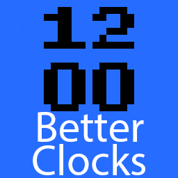

# beauwithabang / better-clocks

I took the useless clock item in Minecraft Bedrock and made it tell unambiguous time based on the in-game day.

## Screenshots

## Installation

Most of this repository is documentation. All you need is the `BetterClocks.MCPACK` file.

Once you have it copied to your PC, and assuming you have Minecraft Bedrock installed, double click the file to "open" it.

If Minecraft is already running, you will see an import message followed by an import successful message.

Before loading your world, open the game settings and go to `Global Resources.` Find BetterClocks and press the activate button.

Make sure that the BetterClocks resource pack is listed above the standard Minecraft resource pack, as resource packs listed above other override those below it. If you find that the resource pack is being overridden by another resource pack at that also changes the clock texture, use the up and down arrows in the Active section to put BetterClocks above the other resource pack. It is safe to put BetterClocks at the very top of your Active list as it only changes the clock textures and nothing else.

## License

[GNU AGPLv3](https://choosealicense.com/licenses/agpl-3.0/)

